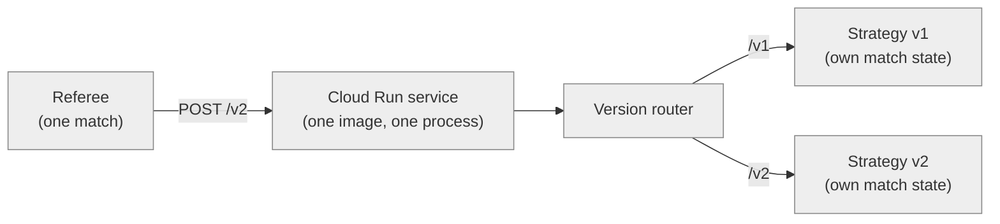

# Serving multiple versions from one endpoint

*How to host two (or twenty) generations of the same strategy without standing up a second Cloud Run
service — or any other infrastructure — per generation.*

## Table of Contents

- [The problem](#the-problem)
- [The pattern](#the-pattern)
- [`/v1` is the day-one default](#v1-is-the-day-one-default)
- [The primitive, in each language](#the-primitive-in-each-language)
- [What does *not* change in your Terraform](#what-does-not-change-in-your-terraform)
- [Registering each version](#registering-each-version)
- [Number generations, don't semver them](#number-generations-dont-semver-them)
- [The frozen-version drift hazard](#the-frozen-version-drift-hazard)
- [The shared outbound key](#the-shared-outbound-key)
- [Retiring a version](#retiring-a-version)

## The problem

An [agent version](glossary.md#agent-version) is immutable once registered — the platform rates it
independently and never rewrites it in place. So the moment you improve your strategy, you're not
editing your existing registration, you're creating a new one, and the new [agent
endpoint](glossary.md#agent-endpoint) it points at has to actually exist somewhere.

The tempting default is one `modules/gcp-cloud-run` call per generation: `my-agent-v1`, `my-agent-v2`,
`my-agent-v3`, each its own service, its own URL, its own idle-cost floor. That works, but it doesn't
scale — twenty strategy iterations is twenty services to build, push images to, and reason about, for
work that is almost always "same container, different decision logic behind the same MCP surface."

## The pattern

**One image. One Cloud Run service. One process. One version router. One URL path per generation.**

The container already holds your whole binary; nothing stops that binary from mounting more than one
`Strategy` (the one extension point each template's own README documents) at more than one path and
routing between them at the HTTP layer, the same way a single API server mounts `/v1/users` and
`/v2/users` without becoming two deployments. A referee dials exactly one path per match — the one named in that version's
`mcp_endpoint_url` — so two generations served from the same process never interfere with each other's
per-match state, as long as each path gets its own `Strategy` instance.



*Figure 1 — One referee call names one version path. The router routes it to that version's own
`Strategy` instance; the other version's state is never touched.*

**Alt text:** A flow diagram. A referee, playing one match, sends a request to path /v2 on a single
Cloud Run service running one image and one process. The service's version router routes requests by
path: /v1 goes to a Strategy v1 instance with its own match state, /v2 goes to a separate Strategy v2
instance with its own match state.

Every template — Go, Python, and TypeScript — ships this router as a small piece of library code, not
something you write by hand: `agent.VersionedHandler` (Go), `build_versioned_app` (Python), and
`versionedRequestListener` (TypeScript). See [The primitive, in each
language](#the-primitive-in-each-language) below.

## `/v1` is the day-one default

Every template mounts its first generation at `/v1` from the moment you scaffold it — there is no
"single-version mode" where the router is skipped and the bare service URL serves MCP directly. This
matters when registering: the bare
[`endpoint_url`](module-contract.md#outputs) output alone **never** serves MCP, even for an agent with
exactly one generation. Always register `<endpoint_url>/v1` (or whichever path the generation you're
registering is mounted at) — see [Registering each version](#registering-each-version).

## The primitive, in each language

Each template's router is a handful of lines on top of a list of `(path, Strategy)` pairs. All three
share the same validation (non-empty paths, `/`-prefixed, not the bare root, no duplicates) and the
same two guarantees: each mount gets its own `Strategy` instance and its own match-state cache, and
both the exact path and its trailing-slash form are registered so a client that doesn't follow
redirects still connects.

### Go

```go
handler, err := agent.VersionedHandler(
	agent.Mount{Path: "/v1", Strategy: myStrategyV1{}},
	agent.Mount{Path: "/v2", Strategy: myStrategyV2{}},
)
if err != nil {
	log.Fatalf("versioned handler: %v", err)
}
if key := os.Getenv("MCP_OUTBOUND_KEY"); key != "" {
	handler = agent.BearerAuth(key, handler)
}
```

`agent.VersionedHandler` is variadic — one `agent.Mount` per generation. It derives the version label
the referee sees in the MCP `initialize` handshake straight from `Path` (`"/v3"` → `"v3"`), so there's
nothing to keep in sync by hand.

### Python

```python
from gismo_agent.serve import Mount, build_versioned_app
from gismo_agent.auth import bearer_auth

app = build_versioned_app([
    Mount("/v1", MyStrategyV1()),
    Mount("/v2", MyStrategyV2()),
])
if auth_key := os.environ.get("MCP_OUTBOUND_KEY"):
    app = bearer_auth(auth_key, app)
```

`build_versioned_app` takes a list of `Mount`s and returns one Starlette app. Each mount gets its own
FastMCP instance and `StateCache`; the version label is derived from `path` the same way as Go.

### TypeScript

```ts
import { versionedRequestListener, type Mount } from "./agent/serve.js";
import { bearerAuth } from "./agent/auth.js";

const mounts: Mount[] = [
  { path: "/v1", strategy: new MyStrategyV1() },
  { path: "/v2", strategy: new MyStrategyV2() },
];
let listener = versionedRequestListener(mounts);
if (authKey) {
  listener = bearerAuth(authKey, listener);
}
```

`versionedRequestListener` takes an array of `Mount`s and returns one dispatching request listener,
wrapped in `bearerAuth` once — the same shape again.

Two things worth calling out, true in all three languages:

- **One `Strategy` instance per version, not one shared instance behind two paths.** A `Strategy`
  implementation that keeps any per-match state (see `module-contract.md`'s warning about
  `max_instances` — the same caching concern applies here) must not let two generations' matches
  collide in it. If your `Strategy` is stateless between calls, sharing is safe, but there's no reason
  to rely on that being true across every future generation you write — construct one instance per
  path and let each own its state, exactly as if it were a separate process.
- **Wrap the whole router in bearer auth once, not each version's handler individually** — each
  template's entrypoint already does this for you. An unauthenticated request to a path that doesn't
  exist should 401, the same as one to a path that does; a 404 would confirm or deny which version
  paths are mounted to a caller with no key at all. You don't need to register both the exact path and
  its trailing-slash form by hand either — the primitive does that for every mount automatically.

## What does *not* change in your Terraform

Nothing. This whole pattern lives in your application code, not your infrastructure — the module call
from the [Quickstart](../README.md#quickstart) is unchanged, digest and all, whether your image serves
one version or twenty:

```hcl
module "agent" {
  source = "github.com/Axemere-LLC/gismo-agent-hosting//modules/gcp-cloud-run?ref=v0.1.0"

  project_id = "my-gcp-project"
  agent_name = "my-gismo-agent"
  image      = "us-central1-docker.pkg.dev/my-gcp-project/my-repo/agent@sha256:abcd...1234"

  secret_env = {
    MCP_OUTBOUND_KEY = "my-gismo-agent-outbound-key"
  }
}
```

Adding a generation means changing what the *image* contains — one more entry in the entrypoint's
mount list (see [The primitive, in each language](#the-primitive-in-each-language)) and a new build —
not changing what module call deploys it. `endpoint_url` stays the same service URL it always was;
only the path segment you append to it when registering changes. See the `add-agent-version` skill in
[`gismo-agent-hosting/.claude/skills/`](../.claude/skills/add-agent-version/SKILL.md) for the guided,
step-by-step version of adding a generation.

## Registering each version

The platform validates `mcp_endpoint_url` as a whole string — it has no notion of a "base URL plus a
path" split — so **register the full URL, path included**, once per generation:

| Generation | `mcp_endpoint_url` |
|---|---|
| v1 | `https://my-gismo-agent-abc123.us-central1.run.app/v1` |
| v2 | `https://my-gismo-agent-abc123.us-central1.run.app/v2` |

Both rows share the same [`endpoint_url`](module-contract.md#outputs) output — only the trailing path
segment differs. See [`registering-your-agent.md`](registering-your-agent.md) for the full
registration flow; nothing else about it changes for a path-scoped endpoint. If you're only adding a
second generation to an already-registered agent, this means a **new** agent version, not an edit to
the existing one — an agent version's endpoint is part of what makes it immutable.

## Number generations, don't semver them

Resist the urge to version this the way you'd version a library (`v1.2.0`, a breaking-change major
bump, and so on) — that's the [code version](glossary.md#code-version) axis, and it's a separate
concern from the one this document covers. Semantic versioning encodes whether an upgrade is safe for
a *consumer* to take without reading the changelog — but an agent version has exactly one consumer,
the referee, and the contract between them is [MCP](glossary.md#mcp), which doesn't change when your
decision logic does. There's no such thing as a "backwards-compatible" strategy change to signal.

The platform's own model agrees: an [agent version](glossary.md#agent-version) is immutable and rated
independently the moment it plays its first match. A "patch" isn't a patch to the platform — it's a
fresh competitor entry whose rating starts from zero, exactly like a "major" would. Flat, incrementing
generation numbers (`v1`, `v2`, `v3`, …) say exactly this and nothing more: match label, URL path, and
whatever you name the `Strategy` implementation in code all derive from the same number, with no
version-arithmetic question ("is this a minor or a major?") to answer for a change that only ever means
one thing on this platform — a new, separately-rated competitor.

The one thing flat numbering can't express is "identical strategy, trivial fix, no material behavior
change." Handle that case by redeploying the *same* generation in place — same path, same image
underneath it, new digest — which is correct exactly when nothing a match would notice actually
changed. If you're not confident of that, mint the next generation instead; resetting the rating is the
honest outcome when behavior moved, even a little. A code-version bump (`deploy-agent --bump`) can
happen on either kind of redeploy — it tracks "which build," independently of whether a new generation
was added.

## The frozen-version drift hazard

Each template ships a fixed input corpus, `fixtures/scenarios.json` — byte-identical across all three
repos — and one recorded "golden" output per `Strategy` under test, `fixtures/expected/<name>.json`. Running the corpus back through a `Strategy` and diffing the result
against its golden is what catches an already-registered generation's *behavior* silently drifting
because a shared helper (turn-rate math, a validation function, anything more than one `Strategy`
calls into) changed underneath it — exactly the failure mode that corrupts a rating a frozen generation
already earned.

The goldens are **not** byte-identical across languages even though the input corpus is: Go serializes
struct fields alphabetically, Python and TypeScript preserve declaration order. Don't compare golden
bytes across repos as a sanity check — compare each repo only against its own prior `git diff`.

Re-recording is a native test-runner flag per language, and **none of the three is scoped to a single
golden** — running any of them touches every case in the file:

| Language | Re-record command |
|---|---|
| Go | `go test ./agent/... -run TestFixtures -update` |
| Python | `python -m pytest tests/test_fixtures.py --update-fixtures` |
| TypeScript | `UPDATE_FIXTURES=1 npm test` (reruns the whole suite) |

That means re-recording after adding a new generation's golden can silently overwrite an existing,
already-registered generation's golden too, if that generation's output happened to have drifted.
**Re-recording an already-registered version's golden is a deliberate act, never a way to make a red
test green.** A failing fixture test on a frozen generation means something shared changed — investigate
and fix the drift, don't erase the evidence by re-recording over it. After any re-record, run
`git diff --stat fixtures/expected/` and confirm only the golden you actually meant to add or update
appears in the diff; anything else is a stop condition. The `add-agent-version` skill in
[`gismo-agent-hosting/.claude/skills/`](../.claude/skills/add-agent-version/SKILL.md) enforces exactly
this check.

## The shared outbound key

One [`secret_env`](module-contract.md#input-variables) covers the whole Cloud Run service, so one
[outbound key](glossary.md#outbound-key) authenticates every version path mounted on it — there's no
way to give `/v1` and `/v2` distinct keys without splitting them into separate services, which defeats
the point of this pattern. That's fine: the key authenticates *the service*, not any one version, and
every registered version pointing at this service should share it. Rotating it rotates it for every
version at once — expected, but worth remembering before you rotate one generation's key expecting the
others to keep working unauthenticated.

## Retiring a version

An old generation's path can keep serving indefinitely at no extra cost — it's the same
[scale-to-zero](glossary.md#scale-to-zero) idle service either way, so there's rarely a reason to
remove it. If you do want to stop maintaining it:

1. Leave its registered agent version alone — deleting or mutating a version with match history isn't
   something this repo or the platform's registration flow does, and its rating stays part of the
   record regardless of what its endpoint does next.
2. Either keep its path mounted (cheapest — nothing to do) or remove its mount entry from your
   entrypoint's mount list and redeploy. A removed path 401s (via the shared bearer-auth wrap, if an
   outbound key is set) or 404s (if not) rather than serving MCP, same as any other unmounted path —
   see [The pattern](#the-pattern).
3. If a retired path stops responding, any future match the matchmaker tries to schedule against that
   version forfeits on missed deadlines. That's a matchmaking-eligibility question, not a hosting one —
   see [`registering-your-agent.md`](registering-your-agent.md#test-before-going-competition-eligible)
   for `competition_eligible`.
